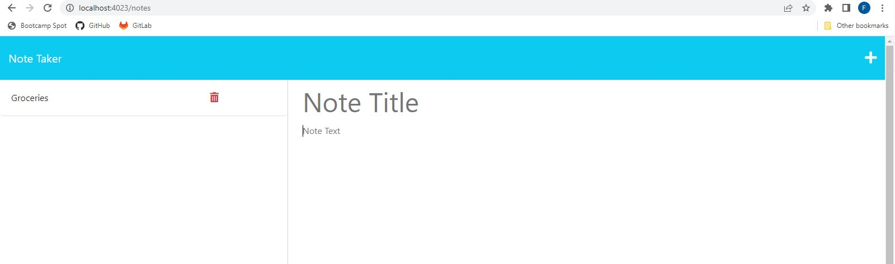

# Note-Taker

## Description

This is a Note Taker application that I built connects the front end and back end components. I enter node server.js in my terminal to activate the API server before entering http://localhost:4023/ in my web browser. I then have the ability to enter, save, and delete notes by using get, post, and delete functions in Javascript.

https://floating-gorge-37466.herokuapp.com/notes

## Screen shot

